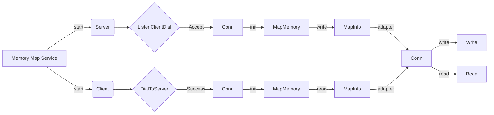

# MMAP

[](https://github.com/godcong/mmap/releases)
[](https://pkg.go.dev/github.com/godcong/mmap)
[](https://codecov.io/gh/godcong/mmap)
[](http://godoc.org/github.com/godcong/mmap)
[](https://github.com/godcong/mmap/blob/main/LICENSE)
[](https://goreportcard.com/report/github.com/godcong/mmap)

The `MMAP` package is a syscall interface to provide safe and efficient access to memory.

Supports for Darwin,Linux and Windows architectures.

## Installation

```
> go get github.com/godcong/mmap@latest
```

## Example

See [`examples`](https://github.com/godcong/mmap/blob/main/examples) folder

## Similar Packages

- github.com/godcong/mmap
- golang.org/x/exp/mmap
- github.com/riobard/godcong
- launchpad.net/gommap
- github.com/edsrzf/mmap-go

## Plan

- [ ] TCP transmits data through shared memory between threads.
- [ ] Turn off shared memory more elegantly.

## Memory Map Flow


## License

This Project used MIT.